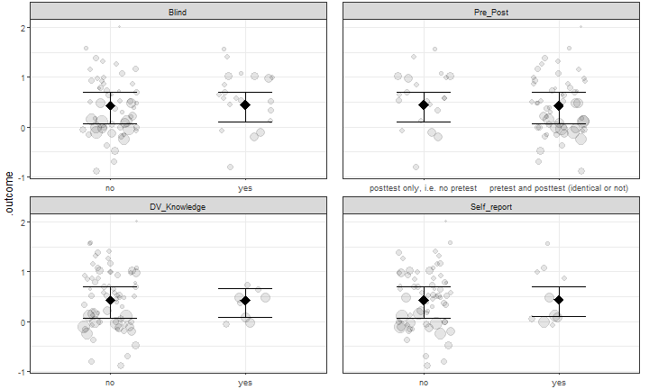

```{r setup, include=FALSE}
#css: https://maxcdn.bootstrapcdn.com/bootstrap/3.3.7/css/bootstrap.min.css
knitr::opts_chunk$set(echo = FALSE)
options("kableExtra.html.bsTable" = TRUE)
#author: 
#- Caspar J. van Lissa
#- Nicole Lucassen
#- Renske Keizer

run_everything <- FALSE

if(!run_everything){
  render_graphics <- FALSE
  run_metafor <- FALSE
  run_recursive_metaforest <- FALSE
  run_metaforest <- FALSE
} else {
  render_graphics <- FALSE
  run_metafor <- FALSE
  run_recursive_metaforest <- FALSE
  run_metaforest <- FALSE
}


library(knitr)
library(kableExtra)
library(metaforest)
library(caret)
library(plotly)
library(foreign)

library(haven)
MLWIN_leidster_def <- read_sav("C:/Users/lissa102/Dropbox/ERASMUS/Psych Methods paper/Ruben Fukking/MLWIN_leidster_def.sav")

data <- read.spss("C:/Users/lissa102/Dropbox/ERASMUS/Psych Methods paper/Ruben Fukking/MLWIN_leidster_def.sav", use.value.labels = TRUE, to.data.frame = TRUE)

variable_labels <- read.csv("Codeboek.csv", stringsAsFactors = FALSE)

table1 <- read.csv("Table1.csv", stringsAsFactors = FALSE)
# Scope: B = broad, N = narrow; focus: K = knowledge, S = skill, A = attitude; setting: C = center-based care, F = family care; Nr. sessions = number of sessions of the program; Hrs: average duration of one session in hours; Age: Average age of trainees;
#Exp (years) = average working experience of trainees; Educ = years of formal education (in years).


table2 <- read.csv("Table2.csv", stringsAsFactors = FALSE)
# Note—Design: W = within-design, B = between design; assign = assignment to conditions is not random (NR), random (RA), or a matching procedure was used (MA); pre-test–post-
# test = experimental design with pre-test and post-test; Nr Exp + Con Start = number of participants in the experimental and control group at the pretest; attrition Exp + Con = attrition (%) for
# experimental and control group; Nr Exp + Con def. = definitive number of participants (at the post-test); Nr ES = number of effect sizes (caregiver or child level) for the treatment.
table2$N.at.start.total <- sapply(table2$N.at.start, function(x){ eval(parse(text = x)) })
table2$N.at.start.exp <- sapply(1:length(table2$N.at.start), function(x){ gsub("^(\\d+).*$", "\\1", table2$N.at.start[x]) })
table2$N.at.start.con <- NA
table2$N.at.start.con[table2$Design == "B"] <- 
  sapply(1:length(table2$N.at.start[table2$Design == "B"]), function(x){ gsub("^.+\\+(\\d+)", "\\1", table2$N.at.start[table2$Design == "B"][x], perl = TRUE) })


table2$N.definitive.total <- sapply(table2$N.definitive, function(x){ eval(parse(text = x)) })
table2$N.definitive.exp <- sapply(1:length(table2$N.definitive), function(x){ gsub("^(\\d+).*$", "\\1", table2$N.definitive[x]) })
table2$N.definitive.con <- NA
table2$N.definitive.con[table2$Design == "B"] <- 
  sapply(1:length(table2$N.definitive[table2$Design == "B"]), function(x){ gsub("^.+\\+(\\d+)", "\\1", table2$N.definitive[table2$Design == "B"][x], perl = TRUE) })


try_to_match <- function(x, y){
  unique_y <- y[!(duplicated(y)|duplicated(y, fromLast = TRUE))]
  unique_x <- x[!(duplicated(x)|duplicated(x, fromLast = TRUE))]
  unique_y <- unique_y[unique_y %in% unique_x]
  sapply(x, function(i){
    #i = x[1]
    if(i %in% unique_y){
      match(i, y)
    } else {
      NA
    }
  })
}

match_data <- data[!duplicated(data$exp_id), ]
match_ids <- try_to_match(match_data$n_exp_d, table2$N.definitive.exp)
match_ids[which(is.na(match_ids))] <- try_to_match(match_data$exper_d, table1$Exp)[which(is.na(match_ids))]
match_ids[which(is.na(match_ids))] <- try_to_match(match_data$n_con2, 
                                                   table2$N.definitive.con)[which(is.na(match_ids))]
match_ids[which(is.na(match_ids))] <- try_to_match(match_data$parex_d,
                                                   table2$N.at.start.exp)[which(is.na(match_ids))]
match_ids[which(is.na(match_ids))] <- 8

tables <- data.frame(table1, table2)
tables <- tables[match_ids, ]

tables <- tables[unlist(sapply(1:nrow(tables), function(x){ rep(x, tables$Nr..ES[x])})), ]

data <- data.frame(data, tables)
names(data)[which(names(data) %in% variable_labels$Name)] <- variable_labels$Newname[na.omit(match(names(data), variable_labels$Name))]
# Prep data and authors text labels
id_vars <- c("study_id", "exp_id", "exptreat_id", "es_id")
numeric_vars <- c("Trainee_Age", "Trainee_Experience", "es_pos_d", "es_sed")
  #c("agecar_d", "exper_d", "es_pos_d", "es_sed")
#categorical_vars <- c("journa_d", "famcare", "integrat", "superv_d", "medium_b", "one_site", "fixed_cu", "alt_trea", "assignme", "know_d", "skills_d", "attitudem_a", "videof_d", "two_grou", "pre_post", "blind_d", "parex_d", "drop_per", "n_exp_d", "n_con2", "es_pre_d",  "selre_d", "knowpo_d", "skillp_d", "attitp_d", "allign_d", "twogr_d")
categorical_vars <- c("Journal", "Setting", "Integrated", "Supervision", "Scope", "Location", "Curriculum", "Control", "Assignment", "Train_Knowledge", "Train_Skills", "Train_Attitude", "Video", "Design", "Pre_Post", "Blind", "Initial_N_exp", "Attrition", "Final_N_exp", "Final_N_con", "Pretest_es", "Self_report", "DV_Knowledge", "DV_Skills", "DV_Attitude", "DV_Alligned", "Two_group_design")


analyzedat <- data[, c("exp_id", categorical_vars, numeric_vars)]
names(analyzedat)[match(c("exp_id", "es_pos_d", "es_sed"), names(analyzedat))] <- c("id_exp", "yi", "vi")
analyzedat$vi <- analyzedat$vi^2
analyzedat$id_effectsize <- 1:nrow(analyzedat)
analyzedat$n_total <- analyzedat$Final_N_con+analyzedat$Final_N_exp

# Function for formatting stats
nicetext <- function(x, digits = 2, equals = TRUE){
  equal_sign <- "= "
  if(x%%1==0){
    outstring <- formatC(x, digits = 0, format = "f")
  } else {
    if(abs(x) <  10^-digits){
      equal_sign <- "< "
      outstring <- 10^-digits
    } else {
      outstring <- formatC(x, digits = digits, format = "f")
    }
  }
  ifelse(equals, paste0(equal_sign, outstring), outstring)
}

# Function to calculate I2
calc_i2 <- function(x) {
  W <- diag(1 / x$vi)
  X <- model.matrix(x)
  P <- W - W %*% X %*% solve(t(X) %*% W %*% X) %*% t(X) %*% W
  outval <- 100 * x$sigma2 / (sum(x$sigma2) + (x$k - x$p) / sum(diag(P)))
  outval <-  c(I2 = (100 * sum(x$sigma2) / (sum(x$sigma2) + (x$k - x$p) / sum(
    diag(P)))), outval)
  names(outval)[c(2, 3)] <- c("Between cluster", "Within cluster")
  outval
}

# Function for interactive funnel plot
funnel_plotlyfi <- function(x, labels = NULL) {
  tau2 <- x$tau2
  weights <- 1 / (x$vi + tau2)
  
  estimate = x$b[1]
  se <- x$se
  
  ses <- sqrt(x$vi)
  
  se.seq = seq(0, max(ses), 0.001)
  
  #Compute vectors of the lower-limit and upper limit values for
  #the 95% CI region
  ll95 = estimate - (1.96 * se.seq)
  ul95 = estimate + (1.96 * se.seq)
  
  #Do this for a 99% CI region too
  ll99 = estimate - (3.29 * se.seq)
  ul99 = estimate + (3.29 * se.seq)
  
  #Confidence interval for summary effect size
  meanll95 = estimate - (1.96 * se)
  meanul95 = estimate + (1.96 * se)
  
  dfCI = data.frame(ll95, ul95, ll99, ul99, se.seq, estimate, meanll95, meanul95)
  dat <-
    data.frame(
      se = ses,
      R = x$yi,
      weights = weights / sum(weights),
      label = labels
    )
  
  #Draw Plot
  fp = ggplot(data = dat) +
    geom_line(aes(x = ll95, y = se.seq), linetype = 'dotted', data = dfCI) +
    geom_line(aes(x = ul95, y = se.seq), linetype = 'dotted', data = dfCI) +
    geom_line(aes(x = ll99, y = se.seq), linetype = 'dashed', data = dfCI) +
    geom_line(aes(x = ul99, y = se.seq), linetype = 'dashed', data = dfCI) +
    geom_segment(aes(
      x = meanll95,
      y = min(se.seq),
      xend = meanll95,
      yend = max(se.seq)
    ), data = dfCI) +
    geom_segment(aes(
      x = meanul95,
      y = min(se.seq),
      xend = meanul95,
      yend = max(se.seq)
    ), data = dfCI) +
    geom_point(aes(
      x = R,
      y = se,
      size = weights,
      colour = label,
      text = label
    ), shape = 1) +
    ylab('Standard Error') + xlab('R') +
    scale_y_continuous(trans = "reverse",
                       limits = c(max(dat$se), 0),
                       expand = c(0, 0)) +
    scale_x_continuous(breaks = seq(-1.25, 2, 0.25)) +
    theme_bw()+
    theme(legend.position="none")
  ggplotly(fp, tooltip = "text") %>% config(displayModeBar = F)
}


```

## Introduction

Secondary analysis of [Fukkink & Lont, 2007](http://spinusa.net/Does%20Training%20Matter_2007_Fukkink.pdf):

A meta-analysis on the effect of training on caregiver competency

<!--Competency: knowledge, attitudes, and skills related to teacher-child interaction-->

Goals of meta-analysis:

1. Summarize (quasi-)experimental studies of caregiver training
2. **What study characteristics are associated with training efficacy?**

Thus: Moderator analysis was an explicit goal of the original work

## The problem with moderators

Meta-analysis intended to summarize highly similar studies

Often **(ab?)used** to summarize diverse bodies of literature

Differences between studies can be coded as moderators and controlled using meta-regression

Problem with meta-regression:

* Lacks power to identify relevant moderators
* Overfitting when the number of studies is not **much larger** than the number of moderators
* And just forget about including interactions!

**Fukkink & Lont coded 28 moderators, for 17 studies**

## A solution: Metaforest

Metaforest: Identifying relevant moderators in meta-analysis using the machine learning algorithm *random forests*  
[R-package: Van Lissa, 2017](https://cran.r-project.org/package=metaforest)

[Validation study: Van Lissa, 2017](https://osf.io/khjgb/)

Advantages:

* Simulations show high power with as few as 20 effect sizes
* Controls overfitting
* Accounts for interactions and non-linear effects


## Description of the data

Search terms:

* train\*, instruct\*, educat\*, prepar\*, experiment\*
* childcare, early childhood, preschool, caregiver\*, teacher\*

Studies published between 1980 and 2005

Databases:

* ERIC
* PsychINFO
* SSCI
* Gray literature
* Backward search by author names

Found `r max(analyzedat$id_exp)` unique samples, yielding `r nrow(analyzedat)` effect sizes (Hedges' G)

<!--Inclusion criteria well-defined:

* Evaluation of caregiver skill training
* Regular childcare setting
* Caregiver primary focus of evaluation

Exclusion decisions explained in paper

Not clear how many articles were screened at each step

Studies were also located by searching for additional references in the references of collected reports. In addition, the databases were searched in a second round, using the names of the authors of relevant reports that had been identified in the original search. At the suggestion of Peters and Kostelnik (1981) and Saracho (1993; see the Introduction) and meta-analytical guidelines (e.g., Rosenthal, 1994), unofficial publications (“fugitive literature”) were also included in the search. The broad-ranging search was followed by a selection of studies, based on a reading of their full content. Selection was based on the following criteria: First, we included only reports that provided information about studies involving specialized caregiver training with a focus on interaction skills with children (see Kontos & Wilcox-Herzog, 1997) in a regular childcare setting. Second, we included only those studies in which the caregiver was the primary focus of the evaluation, possibly supplemented with a focus on children. We did not include studies that focused specifically on children with disabilities, early childhood special education or residential childcare. Studies involving childcare counseling and consultation were also not included. Furthermore, we did not include studies that involved teacher competencies that are not directly related to regular caregiver–child interaction.2 Both two-group designs (i.e., with a treatment and comparison group) and one-group designs with a pretest and posttest were included. Like in many other applied research areas, the pool of relevant childcare studies comprises both designs (Shadish, Cook, & Campbell, 2002; Morris & DeShon, 2002). Following meta-analytic guidelines (Gibbons, Hedeker, & Davis, 1993; Morris & DeShon, 2002; Wampler, Reifman, & Serovich, 2005), we selected all studies to include all empirical evidence available 2 For example, the enhanced frequency of elaborated use of target words during interactive reading (see Wasik and Bond, 2001), specific caregiver behaviors during music activities (see De l’Etoile, 2001) or caregiver attitude towards math activities (see Arnold et al., 2002).  298 R.G. Fukkink, A. Lont / Early Childhood Research Quarterly 22 (2007) 294–311 pertaining to the central hypothesis of this study. Finally, we included only studies that reported the statistics that are necessary to deduce effect sizes. A number of studies did not contain this information. These studies, which included both group designs and single-subject designs, are briefly discussed in a narrative review, but could not be included in the meta-analysis.
-->

## Descriptive statistics

Observed effect sizes ranged from `r nicetext(range(analyzedat[["yi"]])[1], equals = FALSE)` to `r nicetext(range(analyzedat[["yi"]])[2], equals = FALSE)`  
$M_g `r nicetext(mean(analyzedat[["yi"]]))`$, $SD `r nicetext(sd(analyzedat[["yi"]]))`$

Sample sizes ranged from `r min(analyzedat[["n_total"]])` to `r max(analyzedat[["n_total"]])`  
$M_n `r nicetext(mean(analyzedat[["n_total"]]))`$, $SD `r nicetext(sd(analyzedat[["n_total"]]))`$

Several studies reported multiple effect sizes (`r min(table(analyzedat[["id_exp"]]))` to `r max(table(analyzedat[["id_exp"]]))`)


## Replicating the original meta-analysis

```{r metafor_analysis, include=FALSE}
if(run_metafor){
  #Conduct meta-analyses
  model.full <- rma.mv(yi, vi, random = list(~ 1 | id_exp, ~ 1 | id_effectsize), data=analyzedat) 
  model.within_null <- rma.mv(yi, vi, random = list(~ 1 | id_exp, ~ 1 | id_effectsize), sigma2=c(NA,0), data=analyzedat) 
  model.between_null <- rma.mv(yi, vi, random = list(~ 1 | id_exp, ~ 1 | id_effectsize), sigma2=c(0,NA), data=analyzedat) 
  model.both_null <- rma.mv(yi, vi, random = list(~ 1 | id_exp, ~ 1 | id_effectsize), sigma2=c(0,0), data=analyzedat) 
  
  aov_within <- anova(model.full,model.within_null) 
  aov_between <- anova(model.full,model.between_null) 
  aov_bothnull <- anova(model.full,model.both_null) 
  aov_table <- rbind(
  c(df=aov_between$p.f, aov_between$fit.stats.f[c(3:4, 1)], LRT = NA, p = NA),
  c(df=aov_within$p.r, aov_within$fit.stats.r[c(3:4, 1)], LRT = aov_within$LRT, p = aov_within$pval),
  c(df=aov_between$p.r, aov_between$fit.stats.r[c(3:4, 1)], LRT = aov_between$LRT, p = aov_between$pval),
  c(df=aov_bothnull$p.r, aov_bothnull$fit.stats.r[c(3:4, 1)], LRT = aov_bothnull$LRT, p = aov_bothnull$pval)
  )
  rownames(aov_table) <- c("Full three-level model", "Within-studies variance constrained", "Between-studies variance constrained", "Both variance components constrained")
  aov_table[,-c(1,6)] <- formatC(aov_table[,-c(1,6)], digits = 2, format = "f")
  aov_table[,6] <- formatC(as.numeric(aov_table[,6]), digits = 3, format = "f")
  aov_table[1, 5:6] <-""
  write.csv(aov_table, "table_variance_components.csv")
  confints <- confint(model.full)
  save(model.full, aov_table, confints, file = "metafor_results.RData")
  # Check convergence of variance components:
  #par(mfrow=c(2,1))
  #plot.profile1 <- profile(model.full, sigma2=1)
  #plot.profile2 <- profile(model.full, sigma2=2)
} else {
  load("metafor_results.RData")
  i2s <- calc_i2(model.full)
}


```

```{r metafor_moderators, include = FALSE}
mods <- c("Journal", "Curriculum", "DV_Alligned", "Location", "n_total", "DV_Skills")
mod.matrix <- model.matrix(as.formula(paste0("yi~", paste(mods, collapse = "+"))), data = analyzedat)[, -1]
rma.mods.fukkink <- rma(yi = analyzedat$yi, vi = analyzedat$vi, mods = mod.matrix)

one_at_a_time <- t(apply(mod.matrix, 2, function(x){
  #x <- mod.matrix[,1]
  tmp <- rma(yi = analyzedat$yi, vi = analyzedat$vi, mods = x)
  c(tmp$beta[2], tmp$pval[2])
}))
```

Multilevel meta-analysis for dependent effect sizes<font size="2">  
([Van den Noortgate et al., 2013]())</font>

**Overall effect size:**

$\hat{\gamma} `r nicetext(model.full[["b"]][1])`$, 95\% CI [`r nicetext(model.full[["ci.lb"]], equals = FALSE)`, `r nicetext(model.full[["ci.ub"]], equals = FALSE)`]

**Tests for residual heterogeneity**

* $Q(`r nrow(analyzedat)-1`) `r nicetext(model.full[["QE"]])`, p `r nicetext(model.full[["QEp"]])`$
* Total $I^2 `r paste0(nicetext(i2s[1]), "\\%")`$
* Between studies: $I^2_b `r paste0(nicetext(i2s[2]), "\\%")`$, $\sigma^2_b `r nicetext(confints[[1]]$random[1,1])`$, 95\% CI [`r nicetext(confints[[1]]$random[1,2], equals = FALSE)`, `r nicetext(confints[[1]]$random[1,3], equals = FALSE)`]
* Within studies: $I^2_w `r paste0(nicetext(i2s[3]), "\\%")`$, $\sigma^2_w `r nicetext(confints[[2]]$random[1,1])`$, 95\% CI [`r nicetext(confints[[2]]$random[1,2], equals = FALSE)`, `r nicetext(confints[[2]]$random[1,3], equals = FALSE)`]

The overall effect size exactly replicates the findngs in the paper.

<!--, but the estimates of residual heterogeneity differ somewhat. This is likely due to difference in estimators: We used Van den Noortgate's multilevel approach, which was published after Fukkink & Lont's paper. Not clear which multilevel approach they used. -->

## Publication bias

```{r pub_bias, fig.align='center', warning = FALSE} 
beggs <- regtest(x = analyzedat$yi, vi = analyzedat$vi)

#file drawer analysis (fail and safe)
filedrawer <- fsn(yi = analyzedat$yi, vi = analyzedat$vi)

funnel_plotlyfi(model.full, data$Paper)

```

Some evidence for publication bias:

Funnel plot asymmetry test: $z `r nicetext(beggs[["zval"]])`, p `r nicetext(beggs[["pval"]])`$

File drawer analysis indicated that $K = `r filedrawer[["fsnum"]]`$ studies averaging null-results would have to be added to render the summary effect non-significant 

# Moderator analyses

## Original moderator analyses

Original paper describes two approaches for determining important moderators:

1. "All at once": A multivariate meta-regression model with several pre-selected moderators
2. "One at a time": Univariate meta-regression analyses for each moderator

We compared these methods against MetaForest

## Multilevel data solution

When dealing with multilevel data:

* Clustered bootstrapping of dependent effect sizes
* Unbiased prediction error: 
    + Two parallel forests (10.000 trees)
    + Cross-predictions
    + <font size="2">[Janitza, Celik, & Boulesteix, 2016](https://doi.org/10.1007/s11634-016-0276-4)</font>

## Recursive pre-selection algorithm for p >> N

**Problem:** Very large number of potential moderators (28)

**Solution:** Recursive pre-selection; 100 replications

Algorithm:

1. Start with all moderators
2. Conduct random-effects metaforest, with 2000 trees
3. **If** no moderators have negative importance values, or only one moderator, return the resulting model  
   **Else**, drop the variable with most negative variable importance, go back to Step 2

Moderators selected in 30\%+ of replications are retained for further analysis

## Recursive pre-selection results

```{r recursive_metaforest, include = FALSE}
if(run_recursive_metaforest) {
  moderators <- c(
    "Journal",
"Setting",
"Integrated",
"Supervision",
"Scope",
"Location",
"Curriculum",
"Control",
"Assignment",
"Train_Knowledge",
"Train_Skills",
"Train_Attitude",
"Video",
"Design",
"Pre_Post",
"Blind",
"Initial_N_exp",
"Attrition",
"Final_N_exp",
"Final_N_con",
"n_total",
"Pretest_es",
"Self_report",
"DV_Knowledge",
"DV_Skills",
"DV_Attitude",
"DV_Alligned",
"Two_group_design",
"Trainee_Age",
"Trainee_Experience"
  )
  
  mfdat <- analyzedat[, c("id_exp", "yi", "vi", moderators)]
  
  replications <- 100
  
  #Save seeds
  set.seed(5)
  seeds <- round(runif(replications, 0, 10000000))
  while (length(unique(seeds)) < replications) {
    addseeds <- replications - length(unique(seeds))
    seeds <- c(unique(seeds), round(runif(addseeds, 0, 10000000)))
  }
  
  
  recursive_mf <- function(modvars) {
    mf_tmp <-
      ClusterMF(
        as.formula(paste0("yi ~ ", paste(modvars, collapse = " + "))),
        data = mfdat,
        study = "id_exp",
        whichweights = "fixed",
        num.trees = 2000
      )
    if ((!any(mf_tmp$forest$variable.importance < 0)) | (length(mf_tmp$forest$variable.importance) == 1)) {
      return(mf_tmp)
    } else {
      recursive_mf(names(mf_tmp$forest$variable.importance)[-which(
        mf_tmp$forest$variable.importance == min(mf_tmp$forest$variable.importance))]
        )
    }
  }
  
  master_list <- lapply(seeds, function(rep) {
    set.seed(rep)
    recursive_mf(moderators)
  })
  
  save(master_list, file = "recursive_mf_100_manual_preselection.RData")
  
  var_selected <- sapply(moderators, function(this_mod) {
    sum(sapply(master_list, function(x) {
      this_mod %in% names(x$forest$variable.importance)
    }))
  })

    data_var_selected <- data.frame(Variable = factor(names(var_selected)[order(var_selected, decreasing = TRUE)], 
                                      levels = names(var_selected)[order(var_selected, decreasing = TRUE)]),
                    Selected = var_selected[order(var_selected, decreasing = TRUE)])
  plot_recursive <- ggplot(data_var_selected, 
         aes(x = Variable, y = Selected)) +
    geom_point() +
    geom_line(group = 1) +
    theme_bw()+
    geom_hline(yintercept = 30, linetype = 2)+
    ylab("Selected in % of iterations")+
    theme(axis.text.x = element_text(angle = 90, hjust = 1))
  
  png("docs/plot_recursive.png", width = 720, height = 432, units = "px")
  plot_recursive
  dev.off()
  
  save(var_selected, file = "var_selected_100.RData")
  
  write.csv(data_var_selected, "var_selected_100.csv", row.names = FALSE)
  
  moderators <- c(names(var_selected)[var_selected > 30], "id_exp", "vi")
  
  # Run model tuning
  X <- analyzedat[moderators]
  set.seed(756) #set seeds to a random number

  # Set up 10-fold grouped CV
  fit_control <- trainControl(method = "cv", index = groupKFold(analyzedat$id_exp, k = 10))
  
  # Set up a custom tuning grid for the three tuning parameters of MetaForest
  rf_grid <- expand.grid(whichweights = c("random", "fixed", "unif"),
                         mtry = 2:6,
                         min.node.size = 2:6)
  
  # Train the model
  cv.mf.cluster <- train(y = analyzedat$yi, x = X,#from x remove yi and each
                         study = "id_exp", method = ModelInfo_mf(),
                         trControl = fit_control,
                         tuneGrid = rf_grid, num.trees = 10000)
  
  save(cv.mf.cluster, file = "metaforest_preselected_100_output.RData")
  #load("metaforest_preselected_100_output.RData")
  write.csv(cv.mf.cluster[["results"]], "cv_mf_results.csv", row.names = FALSE)
  
  png("docs/convergence.png", width = 720, height = 432, units = "px")
  plot(cv.mf.cluster$finalModel)
  dev.off()  

  var_imp <- VarImpPlot(cv.mf.cluster$finalModel)
  saveRDS(var_imp, "var_imp.RData")
  png("docs/var_imp.png", width = 720, height = 432, units = "px")
  var_imp
  dev.off()

  plot_vars <- cv.mf.cluster$finalModel$forest$variable.importance[cv.mf.cluster$finalModel$forest$variable.importance > 0]
  plot_vars <- names(plot_vars)[order(plot_vars, decreasing = TRUE)]

  png("docs/partial_dep_1.png", width = 720, height = 432, units = "px")
  PartialDependence(cv.mf.cluster$finalModel, plot_vars[1:6], rawdata = T, pi = .95)
  dev.off()

  png("docs/partial_dep_2.png", width = 720, height = 432, units = "px")
  PartialDependence(cv.mf.cluster$finalModel, plot_vars[7:length(plot_vars)], rawdata = T, pi = .95)
  dev.off()
  
} else {
  cv.mf.cluster <- list()
  cv.mf.cluster[["results"]] <- read.csv("cv_mf_results.csv")
  var_selected <- read.csv("var_selected_100.csv")
  
  #var_selected$Variable <- variable_labels$Newname[match(var_selected$Variable, variable_labels$Name)]
  var_selected$Variable <- ordered(var_selected$Variable, levels = var_selected$Variable)
  var_selected$Description <- variable_labels$Beschrijving[match(var_selected$Variable, variable_labels$Newname)]
  plot_recursive <- ggplot(var_selected, 
         aes(x = Variable, y = Selected, Description = Description)) +
    geom_point() +
    geom_line(group = 1) +
    theme_bw()+
    geom_hline(yintercept = 30, linetype = 2)+
    ylab("Selected in % of iterations")+
    theme(axis.text.x = element_text(angle = 90, hjust = 1))
  
  
  var_imp <- readRDS("var_imp.RData")
}

```
```{r table_vars, include = F}
table_mods <- data.frame(Decision = c("Selected", "Dropped"), Variables= c(paste(
  var_selected$Variable[var_selected$Selected > 30], collapse = ", "), paste(
  var_selected$Variable[var_selected$Selected <= 30], collapse = ", ")))
  

row.names(table_mods) <- NULL
table_mods %>%
  knitr::kable(format = "html") %>%
  kable_styling("striped", font_size = 18)#font_size = 18, 
```

<!---->

```{r plot_recursive}
ggplotly(plot_recursive, tooltip = c("Variable", "Description")) %>% config(displayModeBar = F)
```

## Model tuning and cross-validation

Goal: Finding optimal settings for MetaForest analysis

* 10-fold (clustered) cross-validation
* Settings considered:
    + Weights ("random", "fixed", "uniform"),
    + Candidate variables (2, 4, 6)
    + Min. node size = (2, 4, 6)
* Select model with smallest prediction error (RMSE)

Optimal model: `r cv.mf.cluster$results$whichweights[which.min(cv.mf.cluster$results$RMSE)]` weights, `r cv.mf.cluster$results$mtry[which.min(cv.mf.cluster$results$RMSE)]` candidate variables, min node size `r cv.mf.cluster$results$min.node.size[which.min(cv.mf.cluster$results$RMSE)]`

## Results

Cross-validated $R^2_{cv} `r nicetext(cv.mf.cluster[["results"]][["Rsquared"]][which.min(cv.mf.cluster[["results"]][["RMSE"]])])`$

Clear evidence of model convergence:


## Variable importance

```{r plot_mods, include = FALSE}
if(FALSE){
  table_mods <- data.frame(Variable = var_selected$Variable)
  table_mods$p.all <- table_mods$importance.all <- NA
  table_mods$importance.all[match(mods, table_mods$Variable)] <- rma.mods.fukkink$beta[-1]
  table_mods$p.all[match(mods, table_mods$Variable)] <- rma.mods.fukkink$pval[-1]

  table_mods$p.one <- table_mods$importance.one <- NA
  table_mods$importance.one[match(mods, table_mods$Variable)] <- one_at_a_time[, 1]
  table_mods$p.one[match(mods, table_mods$Variable)] <- one_at_a_time[, 2]
  table_mods$importance.mf <- NA
  table_mods$importance.mf[match(names(cv.mf.cluster$finalModel$forest$variable.importance), table_mods$Variable)] <- 
    cv.mf.cluster$finalModel$forest$variable.importance
  
  write.csv(table_mods, "varimp_table.csv", row.names = FALSE)
  
  # Make plot
  table_mods <- read.csv("varimp_table.csv")
  plotdat <- table_mods[!(is.na(table_mods$importance.all)&is.na(table_mods$importance.one)& (table_mods$importance.mf <= 0|is.na(table_mods$importance.mf))), ]
  plotdat$p.mf <- 1
  plotdat$p.mf[plotdat$importance.mf > 0] <- .02
  plotdat[, c("importance.all", "importance.one")] <- lapply(plotdat[, c("importance.all", "importance.one")], function(x){ (abs(x)/max(abs(x), na.rm = TRUE))*100 })
  plotdat$importance.mf[plotdat$importance.mf < 0|is.na(plotdat$importance.mf)] <- 0
  plotdat$importance.mf <- plotdat$importance.mf/max(abs(plotdat$importance.mf), na.rm = TRUE)*100
  order_vars <- plotdat$Variable[order(rowSums(plotdat[, c("importance.all", "importance.one", "importance.mf")], na.rm = TRUE))]
  #plotdat[, c("p.all", "p.one")] <- lapply(plotdat[, c("p.all", "p.one")], formatC, digits = 3, format = "f" )
  
  plotdat[, c("p.all", "p.one", "p.mf")] <- lapply(plotdat[, c("p.all", "p.one", "p.mf")], function(x){ ifelse(x < .05, 1, 0) })
  
  plotdat <- reshape(plotdat, varying = list(Importance = grep("importance", names(plotdat), value = TRUE),
                                                p = grep("^p", names(plotdat), value = TRUE)),
                     direction = "long", v.names = c("Importance", "p"), times = c("All", "One", "MF"))
  plotdat$Variable <- ordered(plotdat$Variable, levels = order_vars)
  plotdat$Importance[is.na(plotdat$Importance)] <- 0
  plotdat$Method <- ordered(plotdat$time, levels = c("MF", "All", "One"), labels = c("Metaforest", "All at once", "One at a time"))
  plot_imp <- ggplot(NULL) + 
    geom_bar(data = plotdat, aes(x = Variable, Importance, fill = Method), stat = "identity", position = "dodge") +
    labs(x = NULL, y = "Importance (percentage of maximum score)") +
    scale_y_continuous(expand = c(0, 0)) + 
    theme_bw() +
    coord_flip()
  
  png("docs/plot_imp.png", width = 720, height = 432, units = "px")
  plot_imp
  dev.off()
}

```


<!-- Focus on which variables are identified by all three methods, which only by metforest -->

Contribution to predictive performance; encompasses interactions/non-linear effects

```{r variable_importance}
varimpdat <- var_imp$data#[nrow(var_imp$data):1, ]
names(varimpdat)[2] <- "Importance"

varimpdat$Variable <- ordered(varimpdat$variable, 
    levels = varimpdat$variable)
varimpdat$Description <- variable_labels$Beschrijving[match(varimpdat$variable, variable_labels$Newname)]
p <- ggplot(varimpdat, aes_string(y = "Variable", x = "Importance", Description = "Description")) + 
    geom_segment(aes_string(x = 0, xend = "Importance", 
      y = "Variable", yend = "Variable"), colour = "grey50", 
      linetype = 2) + geom_vline(xintercept = 0, colour = "grey50", 
    linetype = 1) + geom_point(shape = 1, size = 2) + xlab("Variable Importance (Permutation importance)") + 
    theme_bw() + theme(panel.grid.major.x = element_blank(), 
    panel.grid.minor.x = element_blank(), axis.title.y = element_blank())

ggplotly(p, tooltip = c("Variable", "Importance", "Description")) %>% config(displayModeBar = F)
```


## Difference with original paper

Approaches compared:

1. "All at once": A multivariate meta-regression model with multiple pre-selected moderators
2. "One at a time": Univariate meta-regression analyses for each moderator
3. "MF": MetaForest analysis

Variable importance is defined as:

* Effect size ($\beta$) for regression
* Permutation importance for metaforest

For the sake of making visual comparisons, (absolute) variable importance was rescaled to percentage-of-maximum

```{r varimp_plot}
# Make plot
  table_mods <- read.csv("varimp_table.csv")
  plotdat <- table_mods[!(is.na(table_mods$importance.all)&is.na(table_mods$importance.one)& (table_mods$importance.mf <= 0|is.na(table_mods$importance.mf))), ]
  plotdat$p.mf <- 1
  plotdat$p.mf[plotdat$importance.mf > 0] <- .02
  plotdat[, c("importance.all", "importance.one")] <- lapply(plotdat[, c("importance.all", "importance.one")], function(x){ (abs(x)/max(abs(x), na.rm = TRUE))*100 })
  plotdat$importance.mf[plotdat$importance.mf < 0|is.na(plotdat$importance.mf)] <- 0
  plotdat$importance.mf <- plotdat$importance.mf/max(abs(plotdat$importance.mf), na.rm = TRUE)*100
  order_vars <- plotdat$Variable[order(rowSums(plotdat[, c("importance.all", "importance.one", "importance.mf")], na.rm = TRUE))]
  #plotdat[, c("p.all", "p.one")] <- lapply(plotdat[, c("p.all", "p.one")], formatC, digits = 3, format = "f" )
  
  plotdat[, c("p.all", "p.one", "p.mf")] <- lapply(plotdat[, c("p.all", "p.one", "p.mf")], function(x){ ifelse(x < .05, 1, 0) })
  
  plotdat <- reshape(plotdat, varying = list(Importance = grep("importance", names(plotdat), value = TRUE),
                                                p = grep("^p", names(plotdat), value = TRUE)),
                     direction = "long", v.names = c("Importance", "p"), times = c("All", "One", "MF"))
  plotdat$Variable <- ordered(plotdat$Variable, levels = order_vars)
  plotdat$Importance[is.na(plotdat$Importance)] <- 0
  plotdat$Method <- ordered(plotdat$time, levels = c("MF", "All", "One"), labels = c("Metaforest", "All at once", "One at a time"))
  plotdat$Description <- variable_labels$Beschrijving[match(plotdat$Variable, variable_labels$Newname)]
  suppressWarnings(
  plot_imp <- ggplot(NULL) + 
    geom_bar(data = plotdat, aes(x = Variable, Importance, fill = Method, Description = Description), stat = "identity", position = "dodge") +
    labs(x = NULL, y = "Importance (percentage of maximum score)") +
    scale_y_continuous(expand = c(0, 0)) + 
    theme_bw() +
    coord_flip()
  )
ggplotly(plot_imp, tooltip = c("Variable", "Method", "Importance", "Description")) %>% config(displayModeBar = F)
```

```{r varimp_table, include = FALSE}
print_table <- table_mods
  print_table[, c(2:5)] <- sapply(print_table[, c(2:5)], formatC, digits = 3, format = "f")
print_table[print_table == "  NA"] <- ""
names(print_table)[2:6] <- c("Beta All at once", "p All at once", "Beta one at a time", "p one at a time", "MF importance")
DT::datatable(print_table)
```

## Comparing approaches

**Variables selected by all approaches:**

The fact that these variables were selected in all approaches suggests that these findings are reliable and likely to generalize to new studies/trainings

* DV_Alligned; whether the dependent variable matched the content of the training
* Location; whether the training was implemented across many sites or in one care center
* Curriculum; whether the training followed a fixed curriculum

**Variables only selected by meta-regression:**

The fact that these variables were **not** selected by MetaForest suggests that the pattern in the data does not hold up to bagging and cross-validation. In other words, meta-regression might be capturing noise caused by a few outliers

* Journal; whether the study was published in an academic journal
* DV_Skills; whether the dependent variable assessed skills

**Variables only selected by MetaForest:**

The fact that these variables were **not** selected by meta-regression suggests that this analysis lacks power, or that the effects of these variables are non-linear or interactive

* Final_N_exp and n_total; number of participants in the experimental condition and in total
    + Marginal association plots suggest a non-linear effect: Very small studies tend to have larger effect sizes
* Pretest_es; effect size at pretest
    + Marginal association plots suggest a non-linear effect: Studies with a positive ES at pre-test tend to have a larger ES at post-test, as well
    
* Several other variables were selected, but their variable importance was infinitessimal


## Bivariate marginal association plots 1/2

"Main effects" of each moderator, averaging over all values of the other moderators


## Bivariate marginal association plots 2/2




## Conclusions

MetaForest has an advantage at weeding out relevant moderators, and controls for overfitting

This advantage was especially obvious for continuous moderators with non-linear effects

Of course, binary moderators have a linear effect by definition

<!-- <font size="4">**Substantive**

* Association might be stronger than thought before (.11 vs .08)
* Which aspects of children's language do fathers influence?<font size="2">  
([Cabrera & Tamis-LeMonda, 2013](https://books.google.nl/books?hl=en&lr=&id=Xx-abFyPtg8C&oi=fnd&pg=PR1&dq=Cabrera+%26+Tamis-LeMonda,+2013&ots=3migj0STnv&sig=Apy1_13WSyQMw2J0plIdlzlLmuY#v=onepage&q=Cabrera%20%26%20Tamis-LeMonda%2C%202013&f=false))</font>
* Stronger effects for **generative-** than **receptive** language

**Methodological**

* Research at home > Lab/school (ecological validity?)
* Assessments/observations > questionnaires
* Trained researchers > parent/self-reports

**Statistical**

* Cross-sectional > longitudinal (dissipation over time)
* High dropout rate: Higher effect size (selection effect)
* Partial correlations tend to be stronger (phacking?)
</font>

## Implications for adolescence

Fathers continue to be relevant, outcome variables change

E.g., father involvement associated with adolescents' academic achievement<font size="2">  
([Meta-analysis by Jeynes, 2014](http://sci-hub.tw/10.1177/0042085914525789))</font>

Important to account for moderators in meta-analysis

MetaForest is a powerful technique to explore between-study heterogeneity

## Further information

All data and syntax on [https://osf.io/dz39y/](https://osf.io/dz39y/)

This presentation live at [https://cjvanlissa.github.io/meta_fathers](https://cjvanlissa.github.io/meta_fathers)
-->