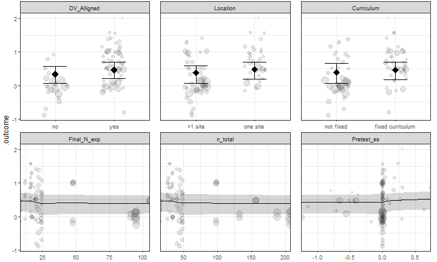

```{r setup, include=FALSE}
#css: https://maxcdn.bootstrapcdn.com/bootstrap/3.3.7/css/bootstrap.min.css
knitr::opts_chunk$set(echo = FALSE)
options("kableExtra.html.bsTable" = TRUE)
#author: 
#- Caspar J. van Lissa
#- Nicole Lucassen
#- Renske Keizer

run_everything <- FALSE

if(!run_everything){
  render_graphics <- FALSE
  run_metafor <- FALSE
  run_recursive_metaforest <- FALSE
  run_metaforest <- FALSE
} else {
  render_graphics <- FALSE
  run_metafor <- FALSE
  run_recursive_metaforest <- FALSE
  run_metaforest <- FALSE
}


library(knitr)
library(kableExtra)
library(metaforest)
library(caret)
library(plotly)
library(foreign)

data <- read.spss("C:/Users/lissa102/Dropbox/ERASMUS/Psych Methods paper/Ruben Fukking/MLWIN_leidster_def.sav", use.value.labels = TRUE, to.data.frame = TRUE)

# Prep data and authors text labels
id_vars <- c("study_id", "exp_id", "exptreat_id", "es_id")
numeric_vars <- c("agecar_d", "exper_d", "es_pos_d", "es_sed")
categorical_vars <- c("journa_d", "famcare", "integrat", "superv_d", "medium_b", "one_site", "fixed_cu", "alt_trea", "assignme", "know_d", "skills_d", "attitudem_a", "videof_d", "two_grou", "pre_post", "blind_d", "parex_d", "drop_per", "n_exp_d", "n_con2", "es_pre_d",  "selre_d", "knowpo_d", "skillp_d", "attitp_d", "allign_d", "twogr_d")

analyzedat <- data[, c("exp_id", categorical_vars, numeric_vars)]
names(analyzedat)[match(c("exp_id", "es_pos_d", "es_sed"), names(analyzedat))] <- c("id_exp", "yi", "vi")
analyzedat$vi <- analyzedat$vi^2
analyzedat$id_effectsize <- 1:nrow(analyzedat)
analyzedat$n_total <- analyzedat$n_con2+analyzedat$n_exp_d

#authors <- paste(analyzedat$sc_authors, analyzedat$sc_pub_year, sep = ", ")
#analyzedat <- analyzedat[, -match("sc_authors", names(analyzedat))]
#effect_sizes <- escalc(ri = analyzedat$yi, ni = analyzedat$n_total, measure = "COR")

# Function for formatting stats
nicetext <- function(x, digits = 2){
  if(x%%1==0){
    formatC(x, digits = 0, format = "f")
  } else {
    if(abs(x) <  10^-digits){
      paste0("< ", 10^-digits)
    } else {
      formatC(x, digits = digits, format = "f")
    }
  }
}

# Function to calculate I2
calc_i2 <- function(x) {
  W <- diag(1 / x$vi)
  X <- model.matrix(x)
  P <- W - W %*% X %*% solve(t(X) %*% W %*% X) %*% t(X) %*% W
  outval <- 100 * x$sigma2 / (sum(x$sigma2) + (x$k - x$p) / sum(diag(P)))
  outval <-  c(I2 = (100 * sum(x$sigma2) / (sum(x$sigma2) + (x$k - x$p) / sum(
    diag(P)))), outval)
  names(outval)[c(2, 3)] <- c("Between cluster", "Within cluster")
  outval
}

# Function for interactive funnel plot
funnel_plotlyfi <- function(x, labels = NULL) {
  tau2 <- x$tau2
  weights <- 1 / (x$vi + tau2)
  
  estimate = x$b[1]
  se <- x$se
  
  ses <- sqrt(x$vi)
  
  se.seq = seq(0, max(ses), 0.001)
  
  #Compute vectors of the lower-limit and upper limit values for
  #the 95% CI region
  ll95 = estimate - (1.96 * se.seq)
  ul95 = estimate + (1.96 * se.seq)
  
  #Do this for a 99% CI region too
  ll99 = estimate - (3.29 * se.seq)
  ul99 = estimate + (3.29 * se.seq)
  
  #Confidence interval for summary effect size
  meanll95 = estimate - (1.96 * se)
  meanul95 = estimate + (1.96 * se)
  
  dfCI = data.frame(ll95, ul95, ll99, ul99, se.seq, estimate, meanll95, meanul95)
  dat <-
    data.frame(
      se = ses,
      R = x$yi,
      weights = weights / sum(weights),
      label = labels
    )
  
  #Draw Plot
  fp = ggplot(aes(x = R, y = se), data = dat) +
    geom_point(aes(
      x = R,
      y = se,
      size = weights,
      text = label
    ), shape = 1) +
    ylab('Standard Error') + xlab('R') +
    geom_line(aes(x = ll95, y = se.seq), linetype = 'dotted', data = dfCI) +
    geom_line(aes(x = ul95, y = se.seq), linetype = 'dotted', data = dfCI) +
    geom_line(aes(x = ll99, y = se.seq), linetype = 'dashed', data = dfCI) +
    geom_line(aes(x = ul99, y = se.seq), linetype = 'dashed', data = dfCI) +
    geom_segment(aes(
      x = meanll95,
      y = min(se.seq),
      xend = meanll95,
      yend = max(se.seq)
    ), data = dfCI) +
    geom_segment(aes(
      x = meanul95,
      y = min(se.seq),
      xend = meanul95,
      yend = max(se.seq)
    ), data = dfCI) +
    scale_y_continuous(trans = "reverse",
                       limits = c(max(dat$se), 0),
                       expand = c(0, 0)) +
    scale_x_continuous(breaks = seq(-1.25, 2, 0.25)) +
    guides(size = FALSE) +
    theme_bw()

  ggplotly(fp, tooltip = "text") %>% config(displayModeBar = F)
}


```

## Introduction


## Previous meta-analysis


## Moderators

Meta-analysis intended to summarize highly similar studies

Often (ab?)used to summarize diverse bodies of research

Differences between studies can be coded as moderators

Problem with classic meta-regression:

* Lacks power to identify relevant moderators
* Overfitting
* Forget about including interactions!

## Metaforest

Machine-learning based technique to identify relevant moderators

High power with as few as 20 studies

Controls overfitting

Accounts for interactions and non-linear effects

[Van Lissa, 2017](https://osf.io/khjgb/)


## Methods

Electronic databases:
<!--
* Web of Science
* PsychInfo
* ERIC
-->
Articles screened: 

Relevant articles: 

Of these, `r max(analyzedat$id_exp)` reported a total of `r nrow(analyzedat)` effect sizes (Cohen's d)

## Dataset

Observed effect sizes ranged from `r nicetext(range(analyzedat[["yi"]])[1])` to `r nicetext(range(analyzedat[["yi"]])[2])`  
$M_r = `r nicetext(mean(analyzedat[["yi"]]))`$, $SD = `r nicetext(sd(analyzedat[["yi"]]))`$

Sample sizes ranged from `r min(analyzedat[["n_total"]])` to `r max(analyzedat[["n_total"]])`  
$M_n = `r nicetext(mean(analyzedat[["n_total"]]))`$, $SD = `r nicetext(sd(analyzedat[["n_total"]]))`$

Several studies reported multiple effect sizes (`r min(table(analyzedat[["id_exp"]]))` to `r max(table(analyzedat[["id_exp"]]))`


## Standard meta-analysis

```{r metafor_analysis, include=FALSE}
if(run_metafor){
  #Conduct meta-analyses
  model.full <- rma.mv(yi, vi, random = list(~ 1 | id_exp, ~ 1 | id_effectsize), data=analyzedat) 
  model.within_null <- rma.mv(yi, vi, random = list(~ 1 | id_exp, ~ 1 | id_effectsize), sigma2=c(NA,0), data=analyzedat) 
  model.between_null <- rma.mv(yi, vi, random = list(~ 1 | id_exp, ~ 1 | id_effectsize), sigma2=c(0,NA), data=analyzedat) 
  model.both_null <- rma.mv(yi, vi, random = list(~ 1 | id_exp, ~ 1 | id_effectsize), sigma2=c(0,0), data=analyzedat) 
  
  aov_within <- anova(model.full,model.within_null) 
  aov_between <- anova(model.full,model.between_null) 
  aov_bothnull <- anova(model.full,model.both_null) 
  aov_table <- rbind(
  c(df=aov_between$p.f, aov_between$fit.stats.f[c(3:4, 1)], LRT = NA, p = NA),
  c(df=aov_within$p.r, aov_within$fit.stats.r[c(3:4, 1)], LRT = aov_within$LRT, p = aov_within$pval),
  c(df=aov_between$p.r, aov_between$fit.stats.r[c(3:4, 1)], LRT = aov_between$LRT, p = aov_between$pval),
  c(df=aov_bothnull$p.r, aov_bothnull$fit.stats.r[c(3:4, 1)], LRT = aov_bothnull$LRT, p = aov_bothnull$pval)
  )
  rownames(aov_table) <- c("Three-level model", "Within-studies variance constrained", "Between-studies variance constrained", "Both variance components constrained")
  aov_table[,-c(1,6)] <- formatC(aov_table[,-c(1,6)], digits = 2, format = "f")
  aov_table[,6] <- formatC(as.numeric(aov_table[,6]), digits = 3, format = "f")
  aov_table[1, 5:6] <-""
  write.csv(aov_table, "table_variance_components.csv")
  confints <- confint(model.full)
  save(model.full, aov_table, confints, file = "metafor_results.RData")
  # Check convergence of variance components:
  #par(mfrow=c(2,1))
  #plot.profile1 <- profile(model.full, sigma2=1)
  #plot.profile2 <- profile(model.full, sigma2=2)
} else {
  load("metafor_results.RData")
  i2s <- calc_i2(model.full)
}


```

```{r metafor_moderators, include = FALSE}
mods <- c("journa_d", "fixed_cu", "allign_d", "one_site", "n_total","skillp_d")
mod.matrix <- model.matrix(as.formula(paste0("yi~", paste(mods, collapse = "+"))), data = analyzedat)[, -1]
rma.mods.fukkink <- rma(yi = analyzedat$yi, vi = analyzedat$vi, mods = mod.matrix)

one_at_a_time <- t(apply(mod.matrix, 2, function(x){
  #x <- mod.matrix[,1]
  tmp <- rma(yi = analyzedat$yi, vi = analyzedat$vi, mods = x)
  c(tmp$beta[2], tmp$pval[2])
}))
```


Multilevel meta-analysis for dependent effect sizes<font size="2">  
([Van den Noortgate et al., 2013]())</font>

**Overall effect size:**

$\hat{\rho} = `r nicetext(model.full[["b"]][1])`$, 95\% CI [`r nicetext(model.full[["ci.lb"]])`, `r nicetext(model.full[["ci.ub"]])`]

**Tests for residual heterogeneity**

* $Q(`r nrow(analyzedat)-1`) = `r nicetext(model.full[["QE"]])`, p = `r nicetext(model.full[["QEp"]])`$
* Total $I^2 = `r paste0(nicetext(i2s[1]), "\\%")`$
* Between studies: $I^2_b = `r paste0(nicetext(i2s[2]), "\\%")`$
* Within studies: $I^2_w = `r paste0(nicetext(i2s[3]), "\\%")`$

## Publication bias

```{r pub_bias, fig.align='center', warning = FALSE} 
beggs <- regtest(x = analyzedat$yi, vi = analyzedat$vi)

#file drawer analysis (fail and safe)
filedrawer <- fsn(yi = analyzedat$yi, vi = analyzedat$vi)

funnel_plotlyfi(model.full, analyzedat$id_exp)

```

Funnel plot asymmetry test: $z = `r nicetext(beggs[["zval"]])`, p = `r nicetext(beggs[["pval"]])`$

File drawer analysis: $K = `r filedrawer[["fsnum"]]`$

# Moderator analyses

## Metaforest analysis

Metaforest analysis  
([R-package by Van Lissa, 2017](https://cran.r-project.org/package=metaforest))

Dependent effect sizes: Clustered bootstrapping

Unbiased prediction error: Two parallel forests (10.000 trees)<font size="2">  
([Janitza, Celik, & Boulesteix, 2016](https://doi.org/10.1007/s11634-016-0276-4))</font>


## Recursive pre-selection

**Problem:** Large number of potential moderators (60)

**Solution:** Recursive pre-selection; 100 replications

Algorithm:

1. Start with all moderators
2. Conduct random-effects metaforest, with 2000 trees
3. **If** no moderators have negative importance values, or only one moderator, return the resulting model  
   **Else**, drop the variable with most negative variable importance, go back to Step 2

Retained moderators selected in 30\%+ of replications


## Recursive pre-selection results

```{r recursive_metaforest, include = FALSE}
if(run_recursive_metaforest) {
  moderators <-
  c("journa_d",
"famcare",
"integrat",
"superv_d",
"medium_b",
"one_site",
"fixed_cu",
"alt_trea",
"assignme",
"know_d",
"skills_d",
"attitudem_a",
"videof_d",
"two_grou",
"pre_post",
"blind_d",
"parex_d",
"drop_per",
"n_exp_d",
"n_con2",
"n_total",
"es_pre_d",
"selre_d",
"knowpo_d",
"skillp_d",
"attitp_d",
"allign_d",
"twogr_d",
"agecar_d",
"exper_d"
  )
  
  mfdat <- analyzedat[, c("id_exp", "yi", "vi", moderators)]
  
  replications <- 100
  
  #Save seeds
  set.seed(5)
  seeds <- round(runif(replications, 0, 10000000))
  while (length(unique(seeds)) < replications) {
    addseeds <- replications - length(unique(seeds))
    seeds <- c(unique(seeds), round(runif(addseeds, 0, 10000000)))
  }
  
  
  recursive_mf <- function(modvars) {
    mf_tmp <-
      ClusterMF(
        as.formula(paste0("yi ~ ", paste(modvars, collapse = " + "))),
        data = mfdat,
        study = "id_exp",
        whichweights = "fixed",
        num.trees = 2000
      )
    if ((!any(mf_tmp$forest$variable.importance < 0)) | (length(mf_tmp$forest$variable.importance) == 1)) {
      return(mf_tmp)
    } else {
      recursive_mf(names(mf_tmp$forest$variable.importance)[-which(
        mf_tmp$forest$variable.importance == min(mf_tmp$forest$variable.importance))]
        )
    }
  }
  
  master_list <- lapply(seeds, function(rep) {
    set.seed(rep)
    recursive_mf(moderators)
  })
  
  save(master_list, file = "recursive_mf_100_manual_preselection.RData")
  
  var_selected <- sapply(moderators, function(this_mod) {
    sum(sapply(master_list, function(x) {
      this_mod %in% names(x$forest$variable.importance)
    }))
  })
  data_var_selected <- data.frame(Variable = factor(names(var_selected)[order(var_selected, decreasing = TRUE)], 
                                      levels = names(var_selected)[order(var_selected, decreasing = TRUE)]),
                    Selected = var_selected[order(var_selected, decreasing = TRUE)])
  plot_recursive <- ggplot(data_var_selected, 
         aes(x = Variable, y = Selected)) +
    geom_point() +
    geom_line(group = 1) +
    theme_bw()+
    theme(axis.text.x = element_text(angle = 90, hjust = 1))
  
  png("docs/plot_recursive.png", width = 720, height = 432, units = "px")
  plot_recursive
  dev.off()
  
  save(var_selected, file = "var_selected_100.RData")
  
  write.csv(data_var_selected, "var_selected_100.csv", row.names = FALSE)
  #load("var_selected_100.RData")
  
  moderators <- c(names(var_selected)[var_selected > 30], "id_exp", "vi")
  
  # Run model tuning
  X <- analyzedat[moderators]
  set.seed(756) #set seeds to a random number

  # Set up 10-fold grouped CV
  fit_control <- trainControl(method = "cv", index = groupKFold(analyzedat$id_exp, k = 10))
  
  # Set up a custom tuning grid for the three tuning parameters of MetaForest
  rf_grid <- expand.grid(whichweights = c("random", "fixed", "unif"),
                         mtry = 2:6,
                         min.node.size = 2:6)
  
  # Train the model
  cv.mf.cluster <- train(y = analyzedat$yi, x = X,#from x remove yi and each
                         study = "id_exp", method = ModelInfo_mf(),
                         trControl = fit_control,
                         tuneGrid = rf_grid, num.trees = 10000)
  
  save(cv.mf.cluster, file = "metaforest_preselected_100_output.RData")
  write.csv(cv.mf.cluster[["results"]], "cv_mf_results.csv", row.names = FALSE)
  
  png("docs/convergence.png", width = 720, height = 432, units = "px")
  plot(cv.mf.cluster$finalModel)
  dev.off()  

  var_imp <- VarImpPlot(cv.mf.cluster$finalModel)
  saveRDS(var_imp, "var_imp.RData")
  png("docs/var_imp.png", width = 720, height = 432, units = "px")
  var_imp
  dev.off()

  plot_vars <- cv.mf.cluster$finalModel$forest$variable.importance[cv.mf.cluster$finalModel$forest$variable.importance > 0]
  plot_vars <- names(plot_vars)[order(plot_vars, decreasing = TRUE)]

  png("docs/partial_dep_1.png", width = 720, height = 432, units = "px")
  PartialDependence(cv.mf.cluster$finalModel, plot_vars[1:6], rawdata = T, pi = .95)
  dev.off()

  png("docs/partial_dep_2.png", width = 720, height = 432, units = "px")
  PartialDependence(cv.mf.cluster$finalModel, plot_vars[7:length(plot_vars)])
  dev.off()
  
} else {
  cv.mf.cluster <- list()
  cv.mf.cluster[["results"]] <- read.csv("cv_mf_results.csv")
  var_selected <- read.csv("var_selected_100.csv")
  var_imp <- readRDS("var_imp.RData")
}

```
```{r table_vars}
table_mods <- data.frame(Decision = c("Selected", "Dropped"), Variables= c(paste(
  var_selected$Variable[var_selected$Selected > 30], collapse = ", "), paste(
  var_selected$Variable[var_selected$Selected <= 30], collapse = ", ")))
  

row.names(table_mods) <- NULL
table_mods %>%
  knitr::kable(format = "html") %>%
  kable_styling("striped", font_size = 18)#font_size = 18, 
```


## Model tuning

Finding optimal analysis settings

* 10-fold (clustered) cross-validation
* Settings considered:
    + Weights ("random", "fixed", "uniform"),
    + Candidate variables (2, 4, 6)
    + Min. node size = (2, 4, 6)
* Select model with smallest prediction error (RMSE)

Optimal model: `r cv.mf.cluster$results$whichweights[which.min(cv.mf.cluster$results$RMSE)]` weights, `r cv.mf.cluster$results$mtry[which.min(cv.mf.cluster$results$RMSE)]` candidate variables, min node size `r cv.mf.cluster$results$min.node.size[which.min(cv.mf.cluster$results$RMSE)]`

## Results

Cross-validated $R^2_{cv} = `r nicetext(cv.mf.cluster[["results"]][["Rsquared"]][which.min(cv.mf.cluster[["results"]][["RMSE"]])])`$

Clear evidence of model convergence:


## Variable importance

```{r plot_mods, include = FALSE}
if(FALSE){
  table_mods <- data.frame(Variable = var_selected$Variable)
  table_mods$p.all <- table_mods$importance.all <- NA
  table_mods$importance.all[match(mods, table_mods$Variable)] <- rma.mods.fukkink$beta[-1]
  table_mods$p.all[match(mods, table_mods$Variable)] <- rma.mods.fukkink$pval[-1]

  table_mods$p.one <- table_mods$importance.one <- NA
  table_mods$importance.one[match(mods, table_mods$Variable)] <- one_at_a_time[, 1]
  table_mods$p.one[match(mods, table_mods$Variable)] <- one_at_a_time[, 2]
  table_mods$importance.mf <- NA
  table_mods$importance.mf[match(names(cv.mf.cluster$finalModel$forest$variable.importance), table_mods$Variable)] <- 
    cv.mf.cluster$finalModel$forest$variable.importance
  
  print_table <- table_mods
  print_table[, c(2:5)] <- sapply(print_table[, c(2:5)], formatC, digits = 3, format = "f")
  
  
  # Make plot
  plotdat <- table_mods[!(is.na(table_mods$importance.all)&is.na(table_mods$importance.one)& (table_mods$importance.mf <= 0|is.na(table_mods$importance.mf))), ]
  plotdat$p.mf <- 1
  plotdat$p.mf[plotdat$importance.mf > 0] <- .02
  plotdat[, c("importance.all", "importance.one")] <- lapply(plotdat[, c("importance.all", "importance.one")], function(x){ (abs(x)/max(abs(x), na.rm = TRUE))*100 })
  plotdat$importance.mf[plotdat$importance.mf < 0|is.na(plotdat$importance.mf)] <- 0
  plotdat$importance.mf <- plotdat$importance.mf/max(abs(plotdat$importance.mf), na.rm = TRUE)*100
  order_vars <- plotdat$Variable[order(rowSums(plotdat[, c("importance.all", "importance.one", "importance.mf")], na.rm = TRUE))]
  #plotdat[, c("p.all", "p.one")] <- lapply(plotdat[, c("p.all", "p.one")], formatC, digits = 3, format = "f" )
  
  plotdat[, c("p.all", "p.one", "p.mf")] <- lapply(plotdat[, c("p.all", "p.one", "p.mf")], function(x){ ifelse(x < .05, 1, 0) })
  
  plotdat <- reshape(plotdat, varying = list(Importance = grep("importance", names(plotdat), value = TRUE),
                                                p = grep("^p", names(plotdat), value = TRUE)),
                     direction = "long", v.names = c("Importance", "p"), times = c("All", "One", "MF"))
  plotdat$Variable <- ordered(plotdat$Variable, levels = order_vars)
  plotdat$Importance[is.na(plotdat$Importance)] <- 0
  plotdat$Method <- ordered(plotdat$time, levels = c("MF", "All", "One"), labels = c("Metaforest", "All predictors", "One at a time"))
  plot_imp <- ggplot(NULL) + 
    geom_bar(data = plotdat, aes(x = Variable, Importance, fill = Method), stat = "identity", position = "dodge") +
    labs(x = NULL, y = "Importance (percentage of maximum score)") +
    scale_y_continuous(expand = c(0, 0)) + 
    theme_bw() +
    coord_flip()
  
  png("docs/plot_imp.png", width = 720, height = 432, units = "px")
  plot_imp
  dev.off()
}

```


<!-- Focus on which variables are identified by all three methods, which only by metforest -->

Contribution to predictive performance; encompasses interactions/non-linear effects


## Bivariate marginal associations 1/2

"Main effects", averaging over all other predictors



## Bivariate marginal associations 2/2


## Difference with original paper

Original paper describes two "methods" for determining important moderators:

1. A multivariate meta-regression model with all pre-selected moderators
2. Univariate meta-regression analyses

We compared both these methods against metaforest

Variable importance is defined as:

* Effect size ($\beta$) for regression
* Permutation importance for metaforest

## Variables selected by method


## Conclusions

<!-- <font size="4">**Substantive**

* Association might be stronger than thought before (.11 vs .08)
* Which aspects of children's language do fathers influence?<font size="2">  
([Cabrera & Tamis-LeMonda, 2013](https://books.google.nl/books?hl=en&lr=&id=Xx-abFyPtg8C&oi=fnd&pg=PR1&dq=Cabrera+%26+Tamis-LeMonda,+2013&ots=3migj0STnv&sig=Apy1_13WSyQMw2J0plIdlzlLmuY#v=onepage&q=Cabrera%20%26%20Tamis-LeMonda%2C%202013&f=false))</font>
* Stronger effects for **generative-** than **receptive** language

**Methodological**

* Research at home > Lab/school (ecological validity?)
* Assessments/observations > questionnaires
* Trained researchers > parent/self-reports

**Statistical**

* Cross-sectional > longitudinal (dissipation over time)
* High dropout rate: Higher effect size (selection effect)
* Partial correlations tend to be stronger (phacking?)
</font>

## Implications for adolescence

Fathers continue to be relevant, outcome variables change

E.g., father involvement associated with adolescents' academic achievement<font size="2">  
([Meta-analysis by Jeynes, 2014](http://sci-hub.tw/10.1177/0042085914525789))</font>

Important to account for moderators in meta-analysis

MetaForest is a powerful technique to explore between-study heterogeneity

## Further information

All data and syntax on [https://osf.io/dz39y/](https://osf.io/dz39y/)

This presentation live at [https://cjvanlissa.github.io/meta_fathers](https://cjvanlissa.github.io/meta_fathers)
-->